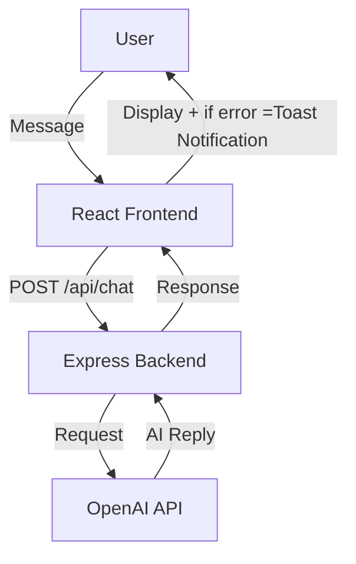

# AI-Powered-Conversation-with-Pharaoh-Talk
### 💬 AI Powered Conversation with Pharaoh Talk (Modern UI)
### 🏺 AI Powered Conversation with Pharaoh Talk

#### - An **AI-powered chat platform** that brings conversations to life with a **modern UI**, **background video**, and **frictionless AI responses** powered by **OpenAI API**.  
#### - Built using **React, Express, and OpenAI API** to deliver smooth, real-time conversations with a unique **Pharaonic theme** 👑.  
---

## 🚀 Features

- 🤖 **AI Conversations** using OpenAI API.  
- 🎨 **Modern UI** with immersive background video.  
- 🔔 **React Hot Toast** for clean, customizable notifications.  
- ⚡ Built with **React (Vite) + TailwindCSS**.  
- 🛠️ **Express.js backend** to handle API requests.  
- 🌐 Fully responsive (desktop & mobile).  
- 🔒 Secure `.env` handling for API keys.  

---
## 🖥️ Tech Stack  

| Category      | Technology |
|---------------|------------|
| Frontend      | React, Vite, TailwindCSS |
| Backend       | Express.js, Node.js |
| AI            | OpenAI API |
| Notifications | React Hot Toast |
| Deployment    | Vercel |
-------------------------
# 📸 Screenshots


### Chat Interface


### Error Toast


### Mobile Responsive


-----------------------

## 🏗️ System Architecture




# 📂 Project Structure
```
└── 📁AI-Powered-Conversation-with-Pharaoh-Talk

    └── 📁backend
        └── 📁routes
            ├── chat.js
        ├── .env
        ├── package-lock.json
        ├── package.json
        ├── server.js
    └── 📁frontend
        └── 📁public
            ├── EY-GPT.webp
        └── 📁src
            └── 📁assets
                └── 📁background vedio
                    ├── backgroundVedio.mp4
                └── 📁img
                    ├── EY-GPT.webp
            └── 📁pages
                ├── Chat.jsx
                ├── Intro.jsx
            ├── App.jsx
            ├── index.css
            ├── main.jsx
        ├── .env
        ├── eslint.config.js
        ├── index.html
        ├── package-lock.json
        ├── package.json
        ├── vite.config.js
    ├── .gitignore
    └── README.md
```
---
# ⚡ Error Handling (React Hot Toast)
### We use React Hot Toast to handle errors in a user-friendly way.
### Example: if the AI server fails, users see a themed toast message instead of a silent error.
----------------------------------------------------------------------------

<br/>


    catch (error){toast.error(

    <span> 

      The Eye of Horus <span style={{ color: "gold", fontSize: "1.2rem" }}>𓂀</span> couldn’t see your message.

    </span>,

    {

      style: {

        background: "#1e1e2f",

        color: "#fff",

        borderRadius: "12px",

      }

    } )} 
------------------------------------------------------------------------------
---
# ⚙️ Installation
- git clone : https://github.com/AliElkhayat/AI-Powered-Conversation-with-Pharaoh-Talk.git
- cd AI-Powered-Conversation-with-Pharaoh-Talk
- cd frontend && npm install
- cd ../backend && npm install
# Add .env files:

Backend (/backend/.env)
- OPENAI_KEY=your_openai_api_key
- PORT=5000
---------
Frontend (/frontend/.env)
- VITE_API_URL=https://your-backend.vercel.app/api/chat
# Run locally:
## Backend
- cd backend
- npm run dev

## Frontend
- cd frontend
- npm run dev

---
# 📦 Deployment

Frontend → Vercel (with vite build → dist)

Backend → Vercel / Render / Railway (Express server)

---

---
# Pharaoh-inspired theme 👑⚡.

# Built with ❤️ by Ali Mahmoud.

# Inspired by the legacy of Pharaohs 🏺𓂀.


Black wolf


